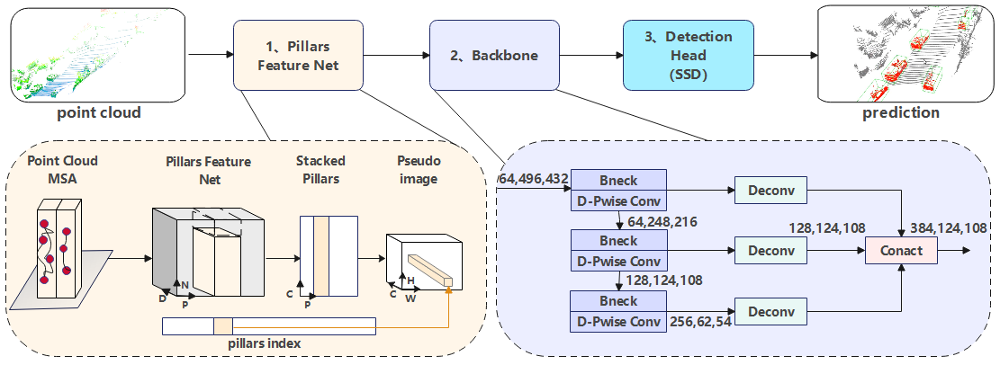

"# LLTP" 

## abstract
Accurate and efficient 3D object detection from LiDAR point clouds is a critical capability for the safe and robust operation of autonomous driving systems. Historically, methods have evolved from point-based to grid-based representations, each with their own trade-offs in capturing spatial information and computational efficiency. While recent advancements in voxel-based methods, such as VoxelNet and PointPillars, have achieved promising performance in terms of detection accuracy, their practical deployment in real-world autonomous vehicles faces two critical limitations: (1) the inherent unstructured nature of point clouds, when discretized into voxels or pillars, can still hinder effective contextual feature extraction in complex driving scenarios, leading to sub-optimal performance in dense or occluded environments; and (2) the high computational demands associated with processing 3D convolutions or large feature maps often prevent real-time inference on resource-constrained edge devices commonly found in autonomous vehicles. To address these persistent challenges, we propose LLTP (Lightweight Local Transformer PointPillar), a lightweight 3D detection framework that strategically integrates local Transformer encoding with a MobileNet-inspired architecture. Our approach introduces two key innovations: First, a columnar self-attention encoder is designed to effectively model intra-pillar contextual relationships through multi-head attention, significantly enhancing spatial semantics preservation and improving overall feature representation by capturing long-range dependencies within vertical structures. Second, a depthwise separable convolutional backbone, augmented with adaptive channel attention, drastically reduces parameters by decoupling spatial and channel-wise operations, thereby improving computational efficiency without compromising representational power. Experimental results demonstrate LLTP's superiority over existing methods—achieving a 75.7\% parameter reduction (from 4.9M to 1.2M+4.2K) compared to the original PointPillars while simultaneously improving mAP by 3.48\% on challenging KITTI moderate difficulty tasks. Furthermore, our framework achieves a 3.7\% improvement on nuScenes benchmarks and enables real-time inference at 23 FPS. Notably, LLTP requires only 11\% of the computational cost of conventional 3D convolutions, robustly outperforming other state-of-the-art methods (e.g., Second, SA-SSD) in terms of parameter efficiency while maintaining highly competitive detection accuracy. These significant advancements collectively enable robust and efficient deployment on embedded systems, ensuring high performance in complex and diverse driving environments without compromising real-time capabilities.




how install
```
conda create --name openmmlab python=3.8 -y
conda activate openmmlab
```

```
pip install -U openmim
mim install mmengine
mim install 'mmcv>=2.0.0rc4'
mim install 'mmdet>=3.0.0'


mim install "mmdet3d"
```

```python
python tools/train.py myconfig.py
```

